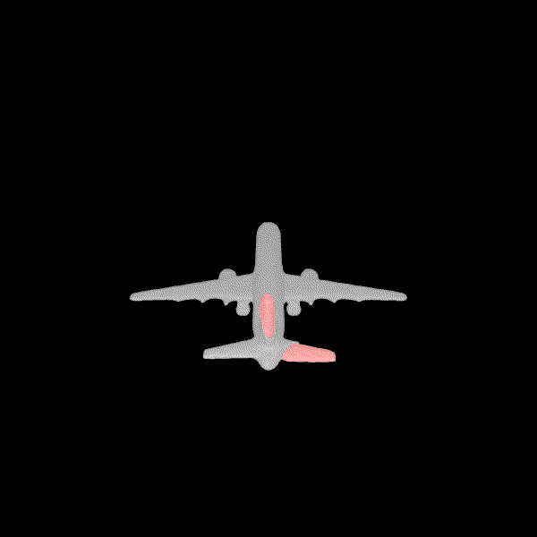
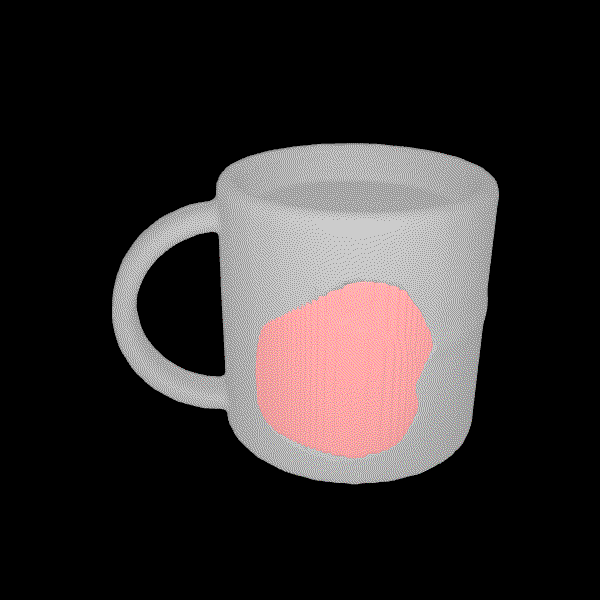
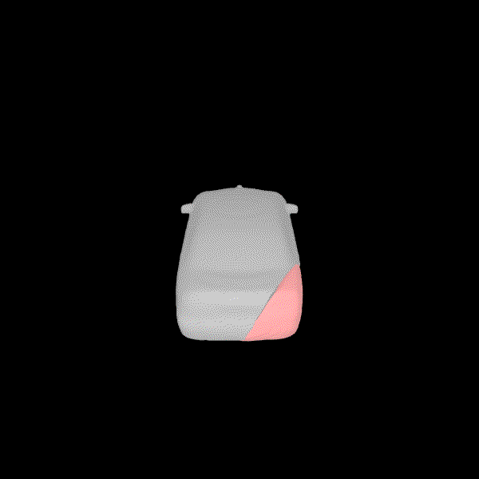

# MendNet
Code for "MendNet: Restoration of Fractured Shapes Using Learned Occupancy Functions." \
Published at SGP 2022.

  

```
@article {10.1111:cgf.14603,
  journal = {Computer Graphics Forum},
  title = {{MendNet: Restoration of Fractured Shapes Using Learned Occupancy Functions}},
  author = {Lamb, Nikolas and Banerjee, Sean and Banerjee, Natasha K.},
  year = {2022},
  publisher = {The Eurographics Association and John Wiley & Sons Ltd.},
  ISSN = {1467-8659},
  DOI = {10.1111/cgf.14603}
}
```

## Installation

Code tested using Ubutnu 18.04 and python 3.8.0.

We recommend using virtualenv. The following snippet will create a new virtual environment, activate it, and install deps.
```
sudo apt-get install virtualenv && \
virtualenv -p python3.8 env && \
source setup.sh && \
pip install -r requirements.txt && \
./install.sh
```
Issues with compiling pyrender are typically solved by upgrading cython: `pip install --upgrade cython`.

If you want to run the fracturing and sampling code, you'll need to install pymesh dependencies:
```
./install_pymesh.sh
```

## Quickstart Inference

If you just want to try out inference, run the following script with the example file. This will infer a restoration and create a gif.
```
cd mendnet
./scripts/infer_quick.sh experiments/mugs/specs.json ../example_files/fractured_mug.obj
```

## Data Preparation

#### Downloading the data
To generate fractured shapes from scratch, download shapenet from https://shapenet.org/. Extract the data into a directory, e.g. "/path/to/above/ShapeNet".

Almost all scripts require that the following environment variable be set to the directory above ShapeNet.
```
export DATADIR="/path/to/above/ShapeNet"
```

TODO: Add fracturing procedure.

## Training

Navigate into the `mendnet` directory.
```
cd mendnet
```

Each training experiment needs a corresponding directory with a "specs.json" file. You can find an example at `mendnet/experiments/mugs`.

To train our approach, run the training python script with the path to an experiment directory.
```
python python/train.py -e experiments/mugs
```

## Inference

Navigate into the `mendnet` directory.
```
cd mendnet
```

Inference (and related operations) is done in four steps:

1) Infer latent codes. 
2) Reconstruct meshes. 
3) Generate renders. 
4) Evaluate meshes.

To infer:
```
./scripts/infer.sh experiments/mugs
```

Data is saved in the experiment directory passed to the reconstruction script, under a `Reconstructions` subdirectory. For example, results generated for our approach will be stored in `mendnet/experiments/mugs/Reconstructions/ours/`. Meshes are stored in the `Meshes` subdirectory. A render of all the results is stored in the top-level reconstruction directory. 
